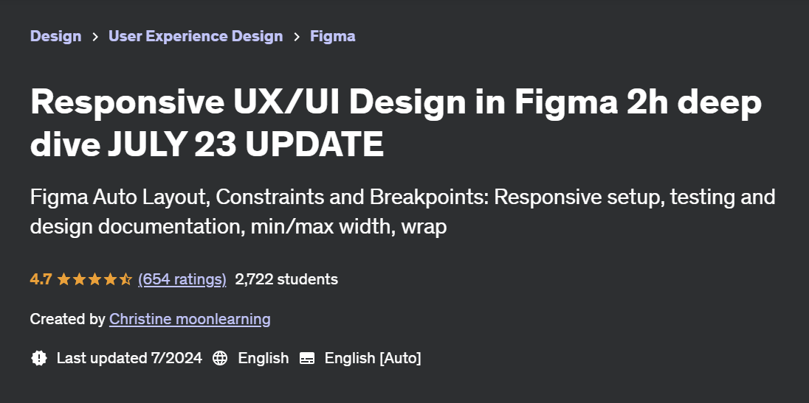

# Responsive UX/UI Design in Figma 2h deep dive JULY 23 UPDATE

Hi!

In this repo I store notes from the course [Responsive UX/UI Design in Figma 2h deep dive JULY 23 UPDATE](https://www.udemy.com/course/responsive-ui-design-in-figma-2h-deep-dive/) made by Christine moonlearning

